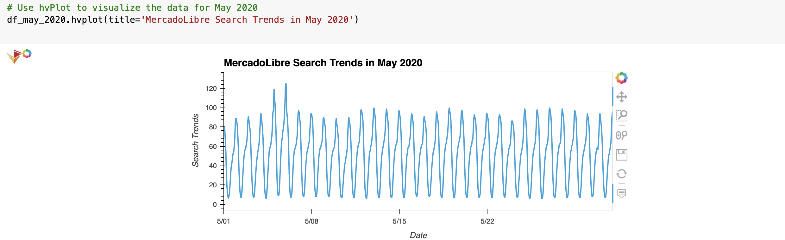
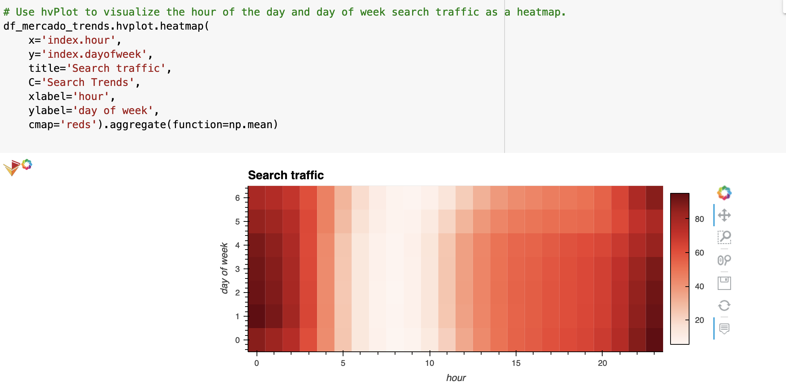
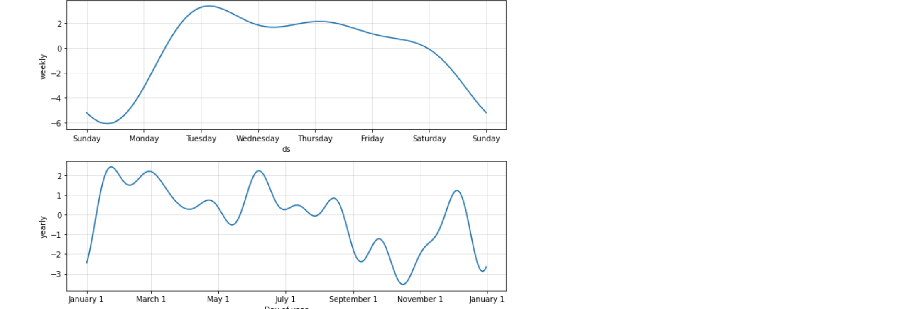
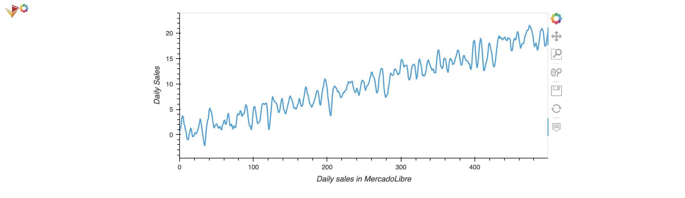
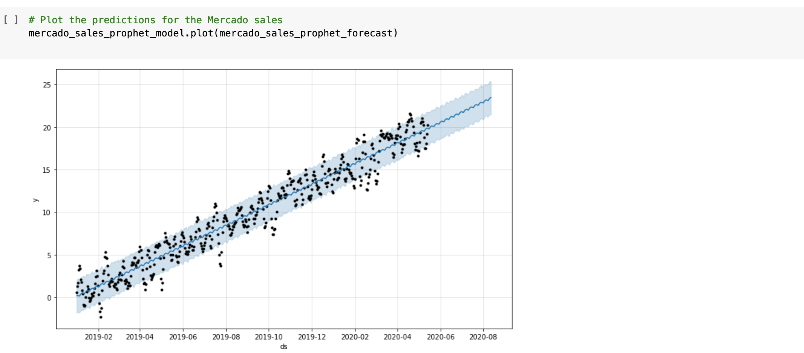

# *Forecasting Net Prophet*
---

**Welcome to my repository for forecasting the stock of MercadoLibre. Please explore the codebase!** <br />

---
## Analytical Summary

This project utilizes the time series model with Prophet to forecast the stock trading of MercadoLibre.

---

## Technologies

This project leverages python 3.7 with the following packages:

* [pandas](https://pandas.pydata.org) - Library for reading/writing csv files and fast manipulation with DataFrames.

* [holoviews](https://holoviews.org/) - Library for data analysis and visualization.

* [fbprophet](https://facebook.github.io/prophet/) - Library for forecasting time series.

* [hvplot](https://hvplot.holoviz.org/) - Library for visualizations.

* [datetime](https://docs.python.org/3/library/datetime.html) - Library manipulating dates and times.
---

## Installation Guide

Before running the application first install the following dependencies.

```python

from imblearn.metrics import classification_report_imbalanced
import warnings

  pip install pandas
  pip install holoviews
  pip install fbprophet
  pip install hvplot
  pip install DateTime

```
---

## Usage

To use this project simply clone the repository and run the code **forecasting_net_prophet.ipynb** in JupyterLab or in VS Code.

---

## Methodology
This project analyzes the dynamics of the MercadoLibre stock, it questions the impact of the search traffic on the stock price. The Time Series model utilizes Prophet library for model predictions and visualizations.
First we analyze the search trends data.
The MercadoLibre search trends in May 2020 were following:



The search traffic appears to be higher at night:



and the searches mostly occur on Tuesdays and in the first half of the year:



The last part of this project predicts the revenue for the company:




---

## License

MIT

---


 
